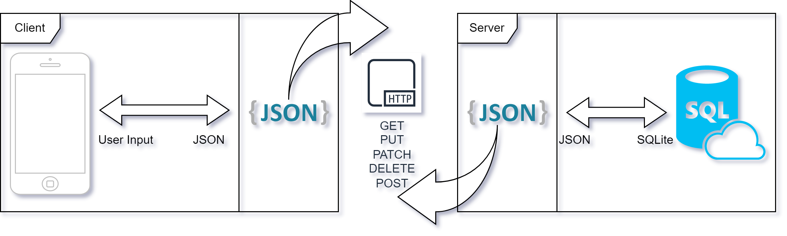

# TestIcle
### The Test Creation Tool you always dreamed about


## What is it?
- Testicle is a Web Application which allows the user to easily create good looking Exams or Tests and Manage, Maintain or Change them seamlessly.
## How do i use it?
- Just Install <a href="https://nodejs.org/en">Node</a> and run `npm start`
## How do you do it?
- We combined our expertise to provide the best and stablest Concept out there. By using SQLite3, Node and Express we have a solid basis for almost everything.
> We even made many things easily maintainable

## How do the Tests look like?
[Example Test 1](./test_icle/examples/test1.pdf)<br>
[Example Test 1 Corrected](./test_icle/examples/test1_corrected.pdf)<br>
[Example Test 2](./test_icle/examples/test2.pdf)<br>
[Example Test 2 Corrected](./test_icle/examples/test2_corrected.pdf)

## Can i improve it?
- Sure just open a Pull Request and show us your ideas!

# Basic Concept



> You need to start the "server.js" to serve the web application and run the API

# Endpoints

## Route Endpoint Type (Body)

- /api/get_me_nice_things

    - This Endpoint should return something from the Database

    - POST
        ``` json
        {
            "name": "something"
        }
        ```

    - Json respone
        ```json
        {
            "test": "test" // This is a test
        }
        ```